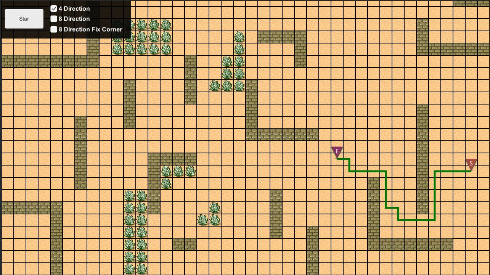
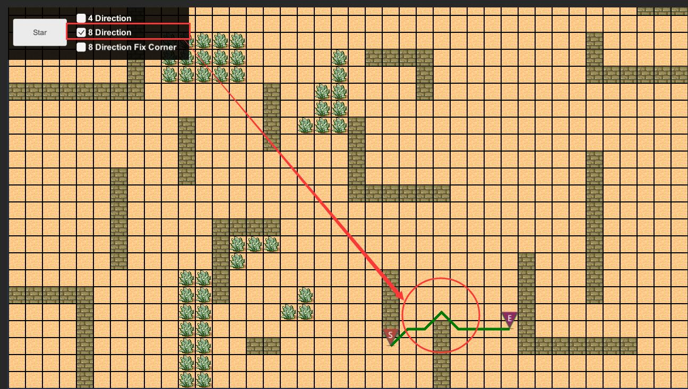
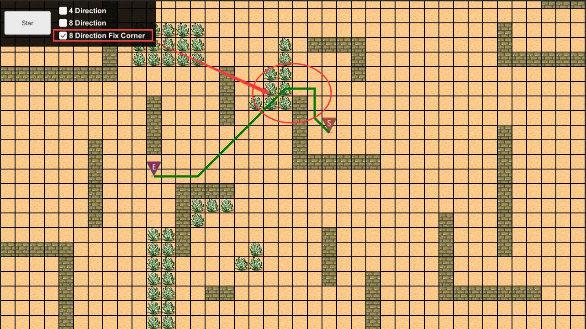

# CEPathFind
a path find for tilebase game in unity


## How to use 

### Extend base engine

before you use `CEPathFind`, you shoud provide an pathfind engine with overrde this class `CEPathFindBasic.cs`


```csharp

	//Get an tile property
	//you can check A start path find wiki for more info about score.
	override public void GetTileProperty (int _tileX, int _tileY, 
	                                     CEPathFindNode _star, CEPathFindNode _end, 
	                                     out bool _isWalkable, out int _score)
	{
		_isWalkable = true;
		_score = 1;
	}


	override public bool isTileWalkable (int _tileX, int _tileY)
	{
		return true;
	}


	override public TILE_SERACH_TYPE GetTileSerachType ()
	{
		return TILE_SERACH_TYPE.EIGHT_DIRECTION_FIX_CORNER;
	}

```


### Call pathfind

there is two way to use it.

-  Immediate return

```csharp
CEPathFindResult result = CEPathFind.FindPath (starTileX, starTileY, endTileX, endTileY, findEngine);

Debug.Log(result.toString());
```

in this way,the function will return the result immediately.

---

-  Async call back

```csharp

CEPathFind.FindPath (starTileX, starTileY, endTileX, endTileY, findEngine,ShowPath);

private void ShowPath (CEPathFindResult _result)
{
	Debug.Log(result.toString());
}
```

in this way ,you need provide an callback(`Action<(CEPathFindResult >`),when the path find finish ,it will call back.

***Attaction***: if you use this way, you should attach CEPathFind.cs to an gameObject.

also you can change the each tick search node num in `CEPathFindAgent.cs`

```
private const int EACH_TICK_SEARCH_NODE_NUM = 50;
```


---
## PathFindType

### 4 direction


### 8 direction


### 8 direction with fix corner



## Issue

e-mail: iamzealotwang@126.com


thanks.  
Eran

